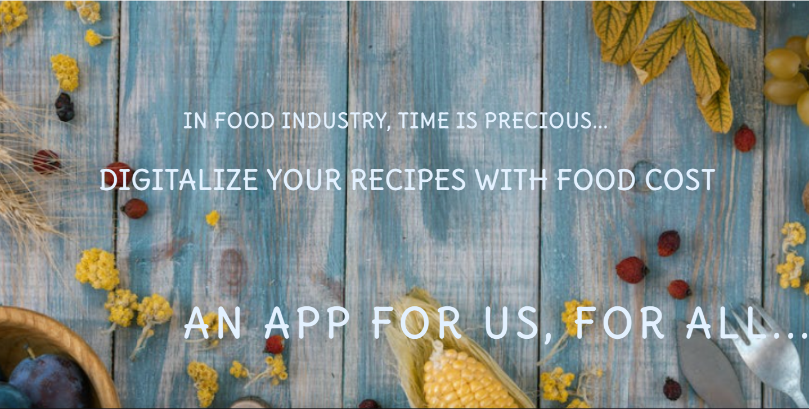

# Purpose of this project

This project was developed in order to demonstrate 
some ability to code in HTML and Css through the 
creation of a responsive static website.

# Food Cost

This website have the unique purpose to present a project called "Food Cost". 
This ambitious project aims to help small entrepreneurs in food industry
 to perform an efficient production with a visual panorama of costs, organization, events, 
 digital recipe books and much more.

* [Check this out!](https://artontray.github.io/PROJECT1/)

# Contents

* [**User Experience UX**](<#user-experience-ux>)
    * [Wireframes](<#wireframes>)
    * [Site Structure](<#site-structure>)
    * [Design Choices](<#design-choices>)
    *   [Typography](<#typography>)
    *   [Color Scheme](<#color-scheme>)
* [**Features**](<#features>)
    * [**Body**](<#body>)
         * [Navigation Bar](<#navigation-bar>)
         * [Middle Page](<#middle-page>)
         * [Footer](<#footer>)
    * [**Home**](<#home-section>)
         * [Landing page](<#landing-page>)
         * [situation](<#situation>)
         * [Are you in this situation?](<#are-you-in-this-situation?>)
         * [Trailer](<#Trailer>)
         * [gallery](<#gallery>)
         * [offers](<#offers>)
         * [roadmap](<#roadmap>)
         * [team](<#team>)
    * [**Partners**](<#partners>)
        * Partnership is important!
        * Partnership listing
        * Partnership timeline
    * [**Suscribe**](<#suscribe>)
         * [suscribe form](<#suscribe-form>)
         * [Offers]
         * [Any questions form]
    * [**To sum up**](<#to-sum-up>)
    * [**Future Features**](<#future-features>)
* [**Technologies Used**](<#technologies-used>)
* [**Testing**](<#testing>)
     * [Am i responsive?]
     * [HTML / CSS Validator]
* [**Deployment**](<#deployment>)
* [**Credits**](<#credits>)
    * [**Content**](<#content>)
    * [**Media**](<#media>)
    * [**Best part of this project**](<#best-part-of-this-project>)
*  [**Acknowledgements**](<#acknowledgements>)

# User Experience (UX)

## Wireframes

The wireframes for this website were produced in [Balsamiq](https://balsamiq.cloud/sjrqfbt/peultvp).
The final site varies slightly from the wireframes due to developments that occured 
during the creation process. 

[Back to top](<#contents>)

## Site Structure

FOOD COST website has three pages. The [home page](index.html) is the default loading page,
[partners](partners.html) and [suscribe](suscribe.html) pages are all accessible primarily 
from the up navigation menu.

[Back to top](<#contents>)

## Design Choices

 * ### Typography
      The font chosen were 'Delius' for all the content of the website. I have chosen
      to import the font directly from the .ttf file to avoid any problem of compatibility
      in the future.
      

 * ### Colour Scheme
      The colour scheme chosen is blue, purple and white.
      Blue evoke feelings of reliability and people feel more secure
      when they see the colour blue. In terms of web design, this means 
      that users may be more likely to purchase, as they view your blue website
       as reliable and professional.

[Back to top](<#contents>)

## Features 

This website is intended for small or private entrepreneurs 
who work in food industry. The main page highlights a 
dynamic menu with 3 links:
* ### Body
  * ### Navigation bar
  - Featured on all three pages, the full responsive navigation bar includes 
  links to the Logo, Home page, Partners and Sign Up page and is 
  identical in each page to allow an easy navigation.
  - This section is fixed and will allow the user to easily navigate from 
  page to page across all devices without having to revert back
   to the previous page via the ‘back’ button. 

[Back to top](<#contents>)
  * ### Middle Page

  From the beginning, i wanted to have a very flexible middle page.
  In this case , flexible means :
  - constituted by different boxes with differents design.
  - easy to change the design just by selecting the right CSS class.
  - middle content can have 1, 2, 3, 4 and even 5 boxes in same line.
  - easy to change the design of the title of each boxes just by selecting 
  the right CSS class.

  - and finally, easy to configure and display in different screen size. 

[Back to top](<#contents>)
  * ### Footer
  - The footer contains social media links (left side) and copyrights area (right side).
  This section is fixed and it will allow the user to comunicate with the team from anywhere in the website.
  The links will open to a new tab to allow easy navigation for the user.

[Back to top](<#contents>)

* ### Home Section
  * ### Landing page

  - The landing page includes an image with catching animation
   to grab users attention ('punchlines').
   

  * ### Situation

  - It was important for me to explain the current situation 
  in small food industry companies to highlights FOOD COST solution's 
  proposal.
  * ### Are you in this situation?

  - A small list of questions which FOOD COST can answers.

  * ### Trailer
  Contains a video "trailer" :
   - I wanted to highlights the possibilities of the FOOD COST app in
  less than 1 minut.
   - The trailer is accesible directly after scrolling down the landing page. This section is 
  valuable as it encourages the user to have a dynamic view of the app's features in less than 1 minut.
  
  

  * ### Gallery
  
  - The image gallery is made in such a way as to see the different stages from the creation
   of the recipe in paper format to final result on the plate.

* ### Offers

  - This section aims to inform the user about allocated fees to each offers from the App.
  - 3 different offers brings possibilities to users to selected the apropriate needed service.
  This section is valuable as it gives details about what is actually included on each offer.

* ### Roadmap

  - This section aims to inform the user about the roadmap of the project. 
  - The roadmap highlights the progress of the project and especially future goals.
  It can allow users to visualize an more accomplished version of the project.

* ### Team

 - This section aims to inform the user about the team. 
  - Providing clear information about a project's team is a guarantee of quality and involvement.

* ### Partners
  This section contains all about partnership : already registered partners
 and their story in relation to the app. 
 Also, a form is available to eventually request as a new partner to the app.
 
  - This section aims to inform the user about partnerships. 
  - Providing partnerships details is bringing guarantee of a sustainable activity.

  * Partnership is important.
  * Partnership listing to highlights our current partners of the App
  * Partnership Timeline to highlights chronologic aspects.

* ### Suscribe

I wanted this page to be displayed everything on the same display, so 
no need to scroll down. You have direct access to the different offers
and just by hovering an offer you acces to payment form.
In this section you can :
- Suscribe as new client by filling up the payment information form 
and select premium package of your choice. 
- Any concerns, please use the form on left side.

* ### To sum up

To sum up, a user can have a direct acces throught a navigation menu
 to informations about
the product, how it works, what are the offers and how to suscribe.

* ### Future Features

- As i wrote in the roadmap, my goal would be to develop the app 
entirely. 
As a first goal :
- Create an log in section
- Create a database where users can add ingredients list with prices 
- Create a nice template for recipes
- Display a recipe book with one click
As a final goal :
- Give the possibility to add a new recipe in the database just by taking a picture
of an hand written recipe and all items auto-detected and then generate
a food cost price and digital recipe. Very ambitious!

## Am I responsive Website?

- __The Sign Up Page__

  - This page will allow the user to get signed up to Love Running to start their running journey with the community. The user will be able specify if they would like to take part in road, trail or both types of running. The user will be asked to submit their full name and email address. 

For some/all of your features, you may choose to reference the specific project files that implement them.

In addition, you may also use this section to discuss plans for additional features to be implemented in the future:

### Features Left to Implement

- Another feature idea

## Testing 

In this section, you need to convince the assessor that you have conducted enough testing to legitimately believe that the site works well. Essentially, in this part you will want to go over all of your project’s features and ensure that they all work as intended, with the project providing an easy and straightforward way for the users to achieve their goals.

In addition, you should mention in this section how your project looks and works on different browsers and screen sizes.

You should also mention in this section any interesting bugs or problems you discovered during your testing, even if you haven't addressed them yet.

If this section grows too long, you may want to split it off into a separate file and link to it from here.

### Validator Testing 

- HTML
  - No errors were returned when passing through the official [W3C validator](https://validator.w3.org/nu/?doc=https%3A%2F%2Fcode-institute-org.github.io%2Flove-running-2.0%2Findex.html)
- CSS
  - No errors were found when passing through the official [(Jigsaw) validator](https://jigsaw.w3.org/css-validator/validator?uri=https%3A%2F%2Fvalidator.w3.org%2Fnu%2F%3Fdoc%3Dhttps%253A%252F%252Fcode-institute-org.github.io%252Flove-running-2.0%252Findex.html&profile=css3svg&usermedium=all&warning=1&vextwarning=&lang=en#css)

### Unfixed Bugs

You will need to mention unfixed bugs and why they were not fixed. This section should include shortcomings of the frameworks or technologies used. Although time can be a big variable to consider, paucity of time and difficulty understanding implementation is not a valid reason to leave bugs unfixed. 

## Deployment

This section should describe the process you went through to deploy the project to a hosting platform (e.g. GitHub) 

- The site was deployed to GitHub pages. The steps to deploy are as follows: 
  - In the GitHub repository, navigate to the Settings tab 
  - From the source section drop-down menu, select the Master Branch
  - Once the master branch has been selected, the page will be automatically refreshed with a detailed ribbon display to indicate the successful deployment. 

The live link can be found here - https://code-institute-org.github.io/love-running-2.0/index.html 

## Credits 

In this section you need to reference where you got your content, media and extra help from. It is common practice to use code from other repositories and tutorials, however, it is important to be very specific about these sources to avoid plagiarism. 

You can break the credits section up into Content and Media, depending on what you have included in your project. 

### Content 

- The text for the Home page was taken from Wikipedia Article A
- Instructions on how to implement form validation on the Sign Up page was taken from [Specific YouTube Tutorial](https://www.youtube.com/)
- The icons in the footer were taken from [Font Awesome](https://fontawesome.com/)

### Media

- The photos used on the home and sign up page are from This Open Source site
- The images used for the gallery page were taken from this other open source site

Congratulations on completing your Readme, you have made another big stride in the direction of being a developer! 

## Other General Project Advice

Below you will find a couple of extra tips that may be helpful when completing your project. Remember that each of these projects will become part of your final portfolio so it’s important to allow enough time to showcase your best work! 

- One of the most basic elements of keeping a healthy commit history is with the commit message. When getting started with your project, read through [this article](https://chris.beams.io/posts/git-commit/) by Chris Beams on How to Write  a Git Commit Message 
  - Make sure to keep the messages in the imperative mood 

- When naming the files in your project directory, make sure to consider meaningful naming of files, point to specific names and sections of content.
  - For example, instead of naming an image used ‘image1.png’ consider naming it ‘landing_page_img.png’. This will ensure that there are clear file paths kept. 

- Do some extra research on good and bad coding practices, there are a handful of useful articles to read, consider reviewing the following list when getting started:
  - [Writing Your Best Code](https://learn.shayhowe.com/html-css/writing-your-best-code/)
  - [HTML & CSS Coding Best Practices](https://medium.com/@inceptiondj.info/html-css-coding-best-practice-fadb9870a00f)
  - [Google HTML/CSS Style Guide](https://google.github.io/styleguide/htmlcssguide.html#General)

Getting started with your Portfolio Projects can be daunting, planning your project can make it a lot easier to tackle, take small steps to reach the final outcome and enjoy the process! 