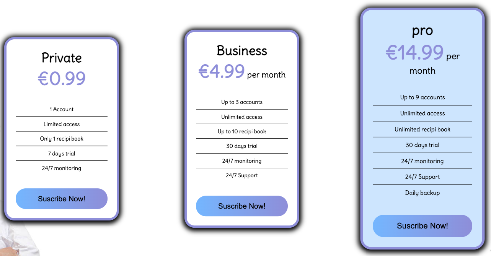

# Purpose of this project

This project was developed in order to demonstrate 
some ability to code in HTML and Css through the 
creation of a responsive static website.

# Food Cost

This website have the unique purpose to present a project called "Food Cost". 
This ambitious project aims to help small entrepreneurs in food industry
 to perform an efficient production with a visual panorama of costs, organization, events, 
 digital recipe books and much more.

* [Check this out!](https://artontray.github.io/PROJECT1/)

## Am I responsive Website? Yes, I do...

## Features 

This website is intended for small or private entrepreneurs 
who work in food industry. The main page highlights a 
dynamic menu with 3 links:
- **Home** 
contains a video "trailer" of the product,
  informations about the product and the problem
  it tend to solve,  the offers available for
  the full access, the roadmap and the team behind the project.

- **Partners** 
contains all about partnership : already registered partners
 and their story in relation to the app. 
 Also, a form is available to eventually request as a new partner to the app.

- **Log in** 
This page is simple : log in if you are already a client to the app
or suscribe as new client by filling up the payment information form 
and select premium package of your choice.

To sum up, a user can have a direct acces throught a navigation menu
 to informations about
the product, how it works, what are the offers and how to suscribe.

### Existing Features

- __Navigation Bar__

  - Featured on all three pages, the full responsive navigation bar includes 
  links to the Logo, Home page, Partners and Sign Up page and is 
  identical in each page to allow an easy navigation.
  - This section is fixed and will allow the user to easily navigate from 
  page to page across all devices without having to revert back
   to the previous page via the ‘back’ button. 

- __The landing page image__

  - The landing includes an image with catching animation to grab their attention ('punchlines').
   

- __The Trailer__

  - The trailer is accesible directly after scrolling down the landing page. This section is 
  valuable as it encourages the user to have a dynamic view of the app's features in less than 1 minut.
  

- __The footer__

  - The footer contains social media links (left side) and copyrights area (right side).
  This section is fixed and it will allow the user to comunicate with the team from anywhere in the website.
  The links will open to a new tab to allow easy navigation for the user.

- __Gallery__

  - The image gallery is made in such a way as to see the different stages from the creation
   of the recipe in paper format to final result on the plate.

- __Premium offers__ 

  - This section aims to inform the user about allocated fees to each offers from the App.
  - 3 different offers brings possibilities to users to selected the apropriate needed service.
  This section is valuable as it gives details about what is actually included on each offer.

- __Road Map__ 

  - This section aims to inform the user about the roadmap of the project. 
  - The roadmap highlights the progress of the project and especially future goals.
  It can allow users to visualize an more accomplished version of the project.

- __The team__ 

  - This section aims to inform the user about the team. 
  - Providing clear information about a project's team is a guarantee of quality and involvement.

- __Partners__ 

  - This section aims to inform the user about partnerships. 
  - Providing partnerships details is bringing guarantee of a sustainable activity.

