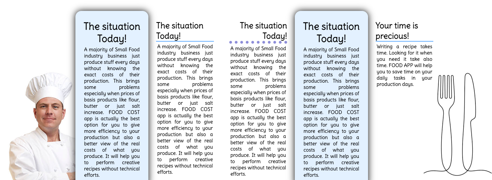
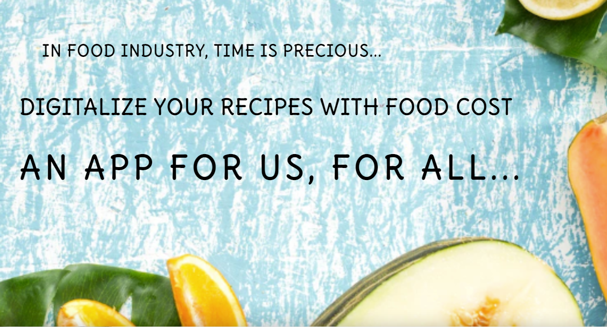
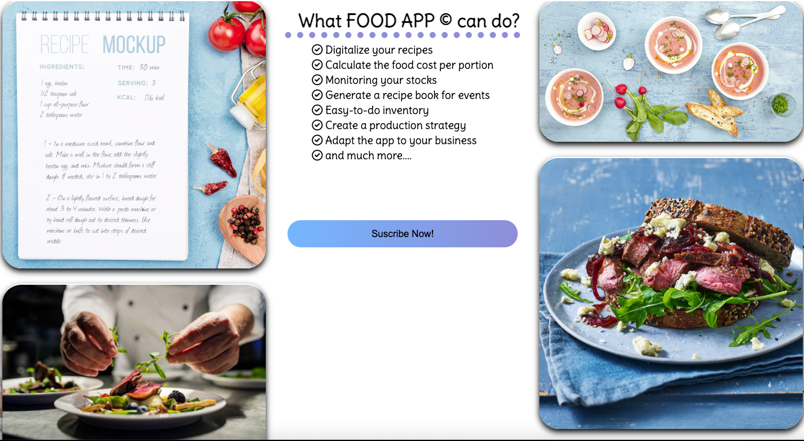
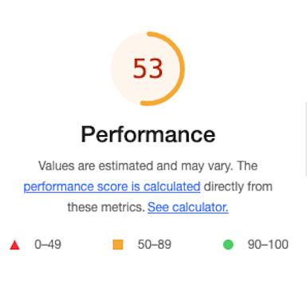

# Purpose of this project

This project was developed in order to demonstrate 
some ability to code in HTML and Css through the 
creation of a responsive static website.

# Food Cost

This website have the unique purpose to present a project called "Food Cost". 
This ambitious project aims to help small entrepreneurs in food industry
 to perform an efficient production with a visual panorama of costs, organization, events, 
 digital recipe books and much more.

* [Check this out!](https://artontray.github.io/PROJECT1/)

# Contents

* [**User Experience UX**](<#user-experience-ux>)
    * [Wireframes](<#wireframes>)
    * [Site Structure](<#site-structure>)
    * [Design Choices](<#design-choices>)
    *   [Typography](<#typography>)
    *   [Color Scheme](<#colour-scheme>)
* [**Features**](<#features>)
    * [**Body**](<#body>)
         * [Navigation Bar](<#navigation-bar>)
         * [Middle Page](<#middle-page>)
         * [Footer](<#footer>)
    * [**Home**](<#home-section>)
         * [Loading page](<#loading-page>)
         * [situation](<#situation>)
         * [Are you in this situation?](<#are-you-in-this-situation>)
         * [Trailer](<#Trailer>)
         * [gallery](<#gallery>)
         * [offers](<#offers>)
         * [roadmap](<#roadmap>)
         * [team](<#team>)
    * [**Partners**](<#partners>)
        * Partnership is important!
        * Partnership listing
        * Partnership timeline
    * [**Suscribe**](<#suscribe>)
         * suscribe form and "Any question form"
         * Any questions form
    * [**Submitted form**](<#submitted-form>)        
    * [**To sum up**](<#to-sum-up>)
    * [**Future Features**](<#future-features>)
* [**Technologies Used**](<#technologies-used>)
* [**Testing**](<#testing>)
     * Am i responsive?
     * HTML / CSS Validator
     * Browser Compatibility
     * Lighthouse
     * Bugs
* [**Deployment**](<#deployment>)
* [**Credits**](<#credits>)
    * [**Content**](<#content>)
    * [**Media**](<#media>)
    * [**Best part of this project**](<#best-part-of-this-project>)
*  [**Acknowledgements**](<#acknowledgements>)

# User Experience (UX)

## Wireframes

The wireframes for this website were produced in [Balsamiq](https://balsamiq.cloud/sjrqfbt/peultvp).
The final site varies slightly from the wireframes due to developments that occured 
during the creation process. 

[Back to top](<#contents>)

## Site Structure

FOOD COST website has three pages. The [home page](https://artontray.github.io/PROJECT1/index.html) is the default loading page,
[partners](https://artontray.github.io/PROJECT1/partners.html) and [suscribe](https://artontray.github.io/PROJECT1/suscribe.html) pages are all accessible primarily 
from the up navigation menu.

[Back to top](<#contents>)

## Design Choices

 * ### Typography
      The font chosen were 'Delius' for all the content of the website. I have chosen
      to import the font directly from the .ttf file to avoid any problem of compatibility
      in the future.
      

 * ### Colour Scheme
      The colour scheme chosen is blue, purple and white.
      Blue evoke feelings of reliability and people feel more secure
      when they see the colour blue. In terms of web design, this means 
      that users may be more likely to purchase, as they view your blue website
       as reliable and professional.

[Back to top](<#contents>)

# Features 

This website is intended for small or private entrepreneurs 
who works in food industry. The main page is composed by three sections :
* ## Body
   ### Navigation bar
  - Featured on all three pages, the full responsive navigation bar includes 
  links to the Logo, Home page, Partners and Suscribe page and is 
  identical in each page to allow an easy navigation.
  - This section is fixed and will allow the user to easily navigate from 
  page to page across all devices without having to revert back
   to the previous page via the ‘back’ button. 

[Back to top](<#contents>)

   ### Middle Page

  From the beginning, i wanted to have a very flexible middle page.
  In this case , flexible means :
  - constituted by different boxes with different design.
  - easy to change the design just by selecting the right CSS class.

Box without design with title on left side :

Box with design with title on right side :

Box with design with title on center :

  - middle content can have 1, 2, 3, 4 and even 5 boxes in same line.

  - easy to change the design of the title of each boxes just by selecting 
  the right CSS class.

[Back to top](<#contents>)
  - and finally, easy to configure and display in different screen size. 

[Back to top](<#contents>)
   ### Footer
  - The footer contains social media links  and email adress.
  This section is situated in the bottom of each page and it will allow the user to comunicate with the team from anywhere in the website.
  The links will open to a new tab to allow easy navigation for the user.

[Back to top](<#contents>)

* ## Home Section
   ### Loading page

  - The loading page includes an image with catching animation
   to grab users attention ('punchlines').
   

[Back to top](<#contents>)
   ### Situation

  - It was important for me to explain the current situation 
  in small food industry companies to highlights FOOD COST solution's 
  proposal.

  ### Are you in this situation?

  - A small list of questions which FOOD COST can answers.

[Back to top](<#contents>)

  ### Trailer
  Contains a video "trailer" :
   - I wanted to highlights the possibilities of the FOOD COST app in
  less than 1 minut.
   - The trailer is accesible directly after scrolling down the loading page. This section is 
  valuable as it encourages the user to have a dynamic view of the app's features in less than 1 minut.
  
  

  [Back to top](<#contents>)

  ### Gallery
  
  - The image gallery is made in such a way as to see the different stages from the creation
   of the recipe in paper format to final result on the plate.

[Back to top](<#contents>)

### Offers

  - This section aims to inform the user about allocated fees to each offers from the App.
  - 3 different offers brings possibilities to users to selected the apropriate needed service.
  This section is valuable as it gives details about what is actually included on each offer.

[Back to top](<#contents>)

### Roadmap

  - This section aims to inform the user about the roadmap of the project. 
  - The roadmap highlights the progress of the project and especially future goals.
  It can allow users to visualize an more accomplished version of the project.

[Back to top](<#contents>)

### Team

 - This section aims to inform the user about the team. 
  - Providing clear information about a project's team is a guarantee of quality and involvement.

[Back to top](<#contents>)

## Partners
  This section contains all about partnership : already registered partners
 and their story in relation to the app. 
 Also, a form is available to eventually request as a new partner to the app.
 
  - This section aims to inform the user about partnerships. 
  - Providing partnerships details is bringing guarantee of a sustainable activity.

  * Partnership is important.
  * Partnership listing to highlights our current partners of the App
  * Partnership Timeline to highlights some chronologic aspects.

[Back to top](<#contents>)

## Suscribe

In this section you can :
- Suscribe as new client by filling up the payment information form 
and select premium package of your choice. 
- Any concerns, please use the form below.

### suscribe form and "Any question form"

### Payment form

[Back to top](<#contents>)

## Submitted form

Two extra pages called `submit-partners.html` and `submit-questions.html`has been created as a sucessfull submit process.

- Every correctly filled forms of the website will load those extra page just to inform that 
the form has been correctly filled and the information will be transmitted.

A meta refresh is used to load home page / suscribe page after 5 secondes.

[Back to top](<#contents>)

## To sum up

To sum up, a user can have a direct acces throught a navigation menu
 to informations about
the product, how it works, what are the offers and how to suscribe.

[Back to top](<#contents>)
## Future Features

As i wrote in the roadmap, my goal would be to develop the app 
entirely. 

**As a first goal** :
- Create an log in section
- Create a database where users can add ingredients list with prices 
- Create a nice template for recipes
- Display a recipe book with one click.

**As a final goal** :
- Create a marketplace where you could share/sell/exchange your best recipes.
- Give the possibility to add a new recipe in the database just by taking a picture
of an hand written recipe and all items auto-detected and then generate
a food cost price and digital recipe. Very ambitious!

[Back to top](<#contents>)

# Technologies Used
* [HTML5](https://html.spec.whatwg.org/) - provides the content and structure for the website.
* [CSS](https://www.w3.org/Style/CSS/Overview.en.html) - provides the styling.
* [Balsamiq](https://balsamiq.com/wireframes/) - used to create the wireframes.
* [Gitpod](https://www.gitpod.io/#get-started) - used to deploy the website.
* [Github](https://github.com/) - used to host and edit the website.

[Back to top](<#contents>)

# Testing

## Am I responsive Website?
Yes, I am!
- The responsive design tests were carried out on Iphones, Samsung Galaxy S8+, Ipad Air and Surface Pro 7 with [Google Chrome DevTools](https://developer.chrome.com/docs/devtools/) and also on [Responsive design checker](https://www.responsivedesignchecker.com/).

- Responsive test from https://ui.dev/amiresponsive :

[Back to top](<#contents>)

## HTML / CSS VALIDATOR

### HTML

The HTML validator results for each page are below:
- index.html :

- partners.html :

- suscribe.html :

[Back to top](<#contents>)
### CSS
  The website site has been tested through the 
  [CSS Validator](https://jigsaw.w3.org/css-validator/).
  No errors or warnings shows up as the picture below shows :

[Back to top](<#contents>)
## Browser Compatibility

The website was tested on the following browsers with no visible issues for the user :
- Google Chrome
- Mozilla Firefox
- Safari

Appearance, functionality and responsiveness were consistent throughout for a range of device sizes and browsers.

[Back to top](<#contents>)

## Lighthouse
The site was also tested using [Google Lighthouse](https://developers.google.com/web/tools/lighthouse) 
in Chrome Developer Tools to test each of the pages for:
* Performance - How the page performs while loading.
* Accessibility - Is the site acccessible for all users and how can it be improved.
* Best Practices - Site conforms to industry best practices.
* SEO - Search engine optimisation. Is the site optimised for search engine result rankings.

My first try was surprising : Very slow to load

This part of the testing process showed up that the site was slow to load, mainly due to 
the image sizes and video trailer. All the images/videos needed to be compressed before adding to the repository.

- Thanks [Panda!](https://tinypng.com/)

and thanks [Veed.io](https://www.veed.io/) :

After using [Panda Tiny png](https://tinypng.com/) and [Veed.io](https://www.veed.io/) :

[Back to top](<#contents>)

### To sum up
To sum up :

- I confirm that this project is responsive, looks good and functions on all standard screen sizes.
- I confirm that the navigation, header, footer and middle content are readable and easy to understand.
- I confirm that the forms works requires entries in every field, will only accept an email in the email field, and the submit button works.

[Back to top](<#contents>) 

### Bugs

## Fixed Bug

  - The Layout in smaller screen as Iphone SE shows some issues with the box shadow.

  
  
  I fixed it easily by take away the shadow effect : `box-shadow: none;` into `style.css file`.

  

  - The website site has been tested through the 
  [W3C html Validator](https://validator.w3.org/).
  Some Warnings shows up at the beginning but easily fixed.

  
  

## Unfixed Bug

The trailer shows up really small in small devices like Iphone 5. I would like to 
add a possibility to put full screen display but it seems I need Javascript
to fix that. [Check this link](https://stackoverflow.com/questions/27768320/html5-video-double-click-to-go-full-screen)

[Back to top](<#contents>)

# Deployment

### To deploy the project :
The site was deployed to GitHub pages. The steps to deploy a site are as follows:
  1. In the GitHub repository, navigate to the **Settings** tab.
  2. Once in Settings, navigate to the **Pages** tab on the left hand side.
  3. Under **Source**, select the branch to **master**, then click **save**.
  4. Once the master branch has been selected, the page will be automatically refreshed with a detailed ribbon display to indicate the successful deployment.

The live link can be found here - [Here](https://github.com/artontray/PROJECT1)

## How to fork a repository :

If you need to "FORK" a repository:

1. Login in to [GitHub](https://github.com/) and go to https://github.com/artontray/PROJECT1
2. In the top right corner, click `Fork`
3. The next page will be the forked version of https://github.com/artontray/PROJECT1 but in your own repository

[Back to top](<#contents>)

### How to create a local clone of this project :

The method from cloning a project from GitHub is below:

1. Under the repository’s name, click on the **code** tab.
2. In the **Clone with HTTPS** section, click on the clipboard icon to copy the given URL.

3. In your IDE of choice, open **Git Bash**.
4. Change the current working directory to the location where you want the cloned directory to be made.
5. Type **git clone**, and then paste the URL copied from GitHub.
6. Press **enter** and the local clone will be created.

[Back to top](<#contents>)

# Credits 

## Content

* The font came from [Google Fonts](https://fonts.google.com/specimen/Delius?query=delius).
* [Veed.io](https://www.veed.io/) was used to compress the video trailer.
* The vertical Timeline idea came from [YouTube tutorial](https://www.youtube.com/watch?v=L9W33EuGjoY&t=345s).
* The Custom Checkbox idea came from [YouTube tutorial](https://www.youtube.com/watch?v=PuoCczjlj1s&t=15s).
* [Balsamiq](https://balsamiq.com/wireframes/) was used to create the wireframes.
* [Readme.so](https://readme.so/) was used to write this readme File.

[Back to top](<#contents>)

## Media

* Some Food Pictures came from [Google Images](https://www.google.com/maps).
* Icons for social media came from [Google Images](https://www.google.com/maps).
* Some Icons came from [Font Awesome](https://fontawesome.com/).
* First loading picture came from [Free pik Images](https://fr.freepik.com/photos-gratuite/fond-bleu-cadre-nourriture_5131541.htm).
* Logos for partnerships come from : 
    - [Connies Wing](https://www.connieswingplustogo.com/)
    - [Le Petit Caraibe](https://en.99designs.fr/logo-design/contests/create-sunset-island-logo-caribbean-restaurant-le-petit-478666)
    - [Le Petit Pavillon](https://www.le-petit-pavillon-restaurant-marseille.com/)
    - [Le petit stamm](https://lepetitstamm.com/)
    - [Le Petit Bistrot](https://dribbble.com/shots/3722307-Le-Petit-Bistrot-Logo-Design?1502272160)

[Back to top](<#contents>)

## Best part of this project

To be honest, best parts of my learning progress are the following :
- Learn how to interact with **github and Gitpod** to create project 
- Learn some **Unix basics commands** to interact with Gitpod/Github
- Learn how to deal with screen functionality and **responsiveness**
- Learn how to use browser **Inspect Element**
- Learn how to make animation with CSS **(@keyframes)**

[Back to top](<#contents>)

# Acknowledgements
The site was completed as a Portfolio 1 Project for the Full Stack Software Developer Diploma at the [Code Institute](https://codeinstitute.net/).
As such I would like to thank the web in general for beeing such a open library for learning, the Slack community for the good vibes and help.

This material has been prepared for educational purposes only and is not intended to provide any offer or service.

Damien B.

[Back to top](<#contents>)